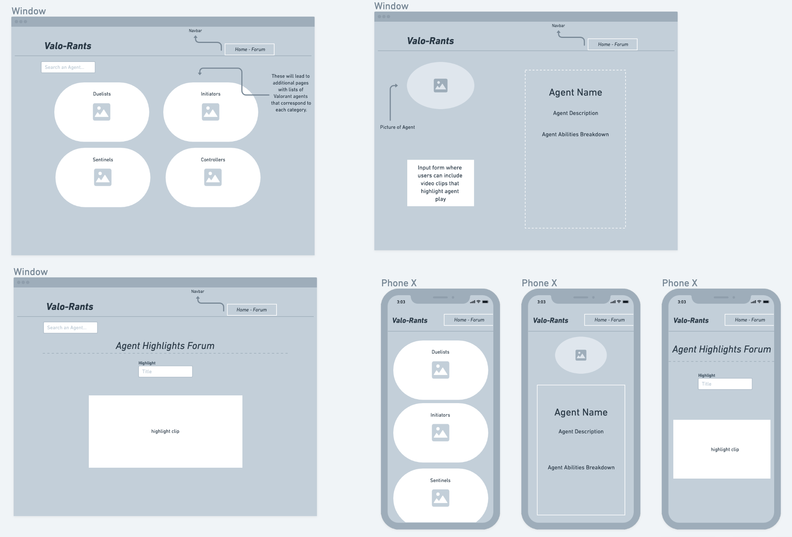
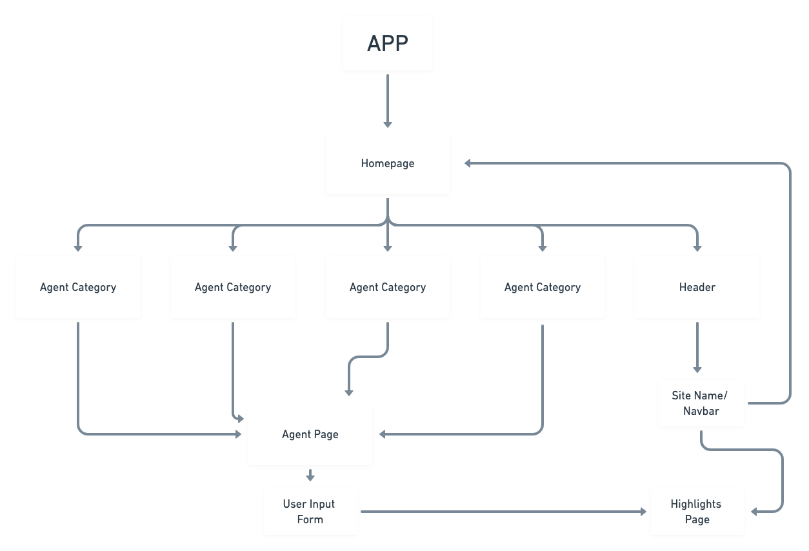

# Project Overview

## Project Name

# valo-rants

## Project Description

My site will host information on every character (agent) from the game VALORANT. There will also be a sort of "forum" where users can comment on video highlights featuring agents from the game.

## Wireframes



## Component Hierarchy



## API and Data Sample

```json
{
  "records": [
    {
      "id": "recXL7r2K0zJ6kFrN",
      "fields": {},
      "createdTime": "2021-12-02T06:07:39.000Z"
    },
    {
      "id": "reccH1N1n3oMp6oyy",
      "fields": {
        "agent": "Jett",
        "agent-abilities": "-Cloudburst\n-Tailwind\n-Updraft",
        "agent-picture": "https://static.wikia.nocookie.net/valorant/images/7/79/Jett_artwork.png/revision/latest?cb=20200602020209"
      },
      "createdTime": "2021-12-02T06:07:39.000Z"
    },
    {
      "id": "recvvHLn2b2rn5462",
      "fields": {},
      "createdTime": "2021-12-02T06:07:39.000Z"
    }
  ]
}
```

### MVP/PostMVP

#### MVP

- Build external API using Airtable
- Render data on page using React components
- Allow user to cycle thru agents info and highlight clips
- Implement heavy styling with CSS flexbox OR Grid

#### PostMVP

_Post MVP TBD_

## Project Schedule

| Day      | Deliverable                                        | Status     |
| -------- | -------------------------------------------------- | ---------- |
| Dec. 1   | Prompt / Wireframes / Priority Matrix / Timeframes | Complete   |
| Dec. 2   | Project Approval                                   | Incomplete |
| Dec. 2-4 | Core Application Structure (HTML, CSS, etc.)       | Incomplete |
| Dec. 4-5 | Pseudocode / actual code                           | Incomplete |
| Dec. 5-6 | Initial Clickable Model, Styling                   | Incomplete |
| Dec. 7-8 | MVP                                                | Incomplete |
| Dec. 9   | Presentations                                      | Incomplete |

## Timeframes

| Component             | Priority | Estimated Time | Time Invested | Actual Time |
| --------------------- | :------: | :------------: | :-----------: | :---------: |
| Adding Form           |    H     |      3hrs      |       0       |      0      |
| Building Airtable API |    H     |      3hrs      |       0       |      0      |
| Total                 |    H     |      6hrs      |     5hrs      |    5hrs     |

## SWOT Analysis

### Strengths:

### Weaknesses:

### Opportunities:

### Threats:
