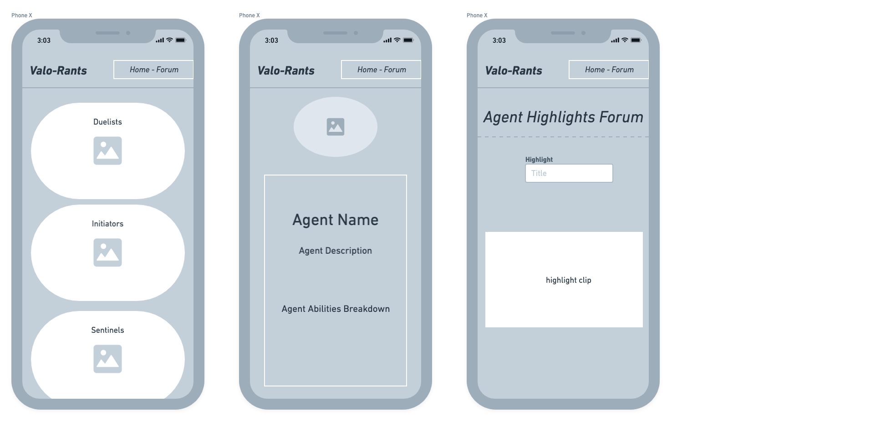

# Project Overview

## Project Name

# valo-rants

## Project Description

My site will host information on every character (agent) from the game VALORANT. These agents will be split into four categories. Each category will navigate the user to a new page where each agent that corresponds with said category will be listed. Each agent will have a navigable page with information about that agent listed. There will also be a sort of "forum" where users can comment on video highlights featuring agents from the game.

## Wireframes

### Desktop


### Mobile



## Component Hierarchy


## API and Data Sample

```json
{
  "records": [
    {
      "id": "recXL7r2K0zJ6kFrN",
      "fields": {
        "category": "duelist",
        "agent": "phoenix",
        "highlight-clip": "https://www.youtube.com/watch?v=VJ6857sJm-k&ab_channel=ValorantVision",
        "description": "An explosive character who can aid in combat by blinding or blocking the vision of enemies.",
        "agent-abilities": "-Blaze -Curveball -Hot Hands",
        "agent-picture": "https://fastcdn.mobalytics.gg/assets/valorant/images/agents/icons/phoenix.png"
      },
      "createdTime": "2021-12-02T06:07:39.000Z"
    },
    {
      "id": "reccH1N1n3oMp6oyy",
      "fields": {
        "category": "duelist",
        "agent-abilities": "-Cloudburst\n-Tailwind\n-Updraft",
        "agent-picture": "https://static.wikia.nocookie.net/valorant/images/7/79/Jett_artwork.png/revision/latest?cb=20200602020209",
        "agent": "jett",
        "description": "A mobility based character tasked to aggressively take space from the enemy.",
        "highlight-clip": "https://www.youtube.com/watch?v=E3bnCP5RQ44&ab_channel=ValorantVision"
      },
      "createdTime": "2021-12-02T06:07:39.000Z"
    },
    {
      "id": "recvvHLn2b2rn5462",
      "fields": {},
      "createdTime": "2021-12-02T06:07:39.000Z"
    }
  ]
}
```

### MVP/PostMVP

#### MVP

- Build external API using Airtable
- Render data on page using React components
- Allow user to cycle thru agents info and highlight clips
- Implement heavy styling with CSS flexbox OR Grid
- Allow users to edit agent info page
- Add form to allow users to add an agent

#### PostMVP

- Implement search feature that allows user to directly navigate to an agent.
- Allow users ability to post and embed highlight videos.
- Add a comment section to highlights forum.

## Project Schedule

| Day      | Deliverable                                        | Status     |
| -------- | -------------------------------------------------- | ---------- |
| Dec. 1   | Prompt / Wireframes / Priority Matrix / Timeframes | Complete   |
| Dec. 2   | Project Approval                                   | Incomplete |
| Dec. 2-4 | Core Application Structure (HTML, CSS, etc.)       | Incomplete |
| Dec. 4-5 | Pseudocode / actual code                           | Incomplete |
| Dec. 5-6 | Initial Clickable Model, Styling                   | Incomplete |
| Dec. 7-8 | MVP                                                | Incomplete |
| Dec. 9   | Presentations                                      | Incomplete |

## Timeframes

| Component             | Priority | Estimated Time | Time Invested | Actual Time |
| --------------------- | :------: | :------------: | :-----------: | :---------: |
| Pseudocode            |    H     |      5hrs      |       0       |      0      |
| Building Airtable API |    H     |      3hrs      |      .5       |      0      |
| Category 1 Build      |    H     |      3hrs      |       0       |      0      |
| Category 2 Build      |    H     |      3hrs      |       0       |      0      |
| Category 3 Build      |    H     |      3hrs      |       0       |      0      |
| Category 4 Build      |    H     |      3hrs      |       0       |      0      |
| Agents Lists          |    H     |      4hrs      |       0       |      0      |
| Navigation            |    H     |     1.5hrs     |       0       |      0      |
| CSS Styling           |    H     |      5hrs      |       0       |      0      |
| Post-MVP              |    H     |      3hrs      |       0       |      0      |
| Total                 |    H     |    33.5hrs     |     .5hrs     |    0hrs     |

## SWOT Analysis

### Strengths:

Although I feel my idea is complex, I have a clear vision of what I want to build.

### Weaknesses:

Even after two weeks learning I am still struggling with React. I will be constantly referencing old assignments, labs, etc.

### Opportunities:

I hope to really cement my understanding of React over this Project.

### Threats:

I have GOT to learn to ask for help and also to understand when I definitely need it.
